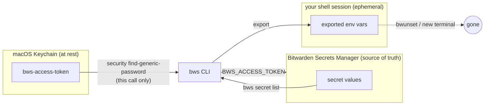

# bw-flow

Shell functions that pull secrets from [Bitwarden Secrets Manager](https://bitwarden.com/products/secrets-manager/) directly into your shell's environment — no `.env` files, no secrets written to disk.

## What it does

`bwset` and `bwunset` are zsh/bash **functions**, not subprocesses — they modify your live shell's environment directly, no `eval "$(...)"` needed. The Bitwarden Secrets Manager (`bws`) access token is read from the macOS Keychain fresh on every call and passed to `bws` as an environment variable for that call only; it is never exported into your interactive shell. Only the secret *values* you explicitly ask for end up in your environment.



Nothing but the requested secret values ever lands in the shell, and nothing is written to disk at any step.

### Why not just a `.env` file?

A `.env` file is a plaintext secret sitting on disk. It lingers after you're done with it, gets swept up in backups and disk snapshots, can be committed by accident, and — the real problem — is readable by *any* process with filesystem access to that path, no confirmation, no audit trail. A `.env` at a repo root is also usually over-shared: every tool that runs in that directory (editors, linters, build scripts, a compromised dependency) can read it, whether or not that particular step needed secrets.

`bwset` avoids that shape of risk:

- Secret values live only in your shell session's memory, exported for the process tree you're actively working in — not on disk, not persisted between sessions.
- The one long-lived credential, the `bws` access token, sits behind macOS Keychain's access control instead of a world-readable file.
- Restart your terminal (or run `bwunset --all`) and the secrets are gone until you `bwset` again.

## Requirements

- macOS (uses the `security` command-line tool for Keychain access)
- [`bws`](https://bitwarden.com/help/secrets-manager-cli/) — the Bitwarden Secrets Manager CLI
- [`jq`](https://jqlang.org/)
- A Bitwarden Secrets Manager machine account access token

## Setup

1. In Bitwarden Secrets Manager, create a machine account access token (Secrets Manager → Machine accounts).
2. Store it in the macOS Keychain.

   If you want to be prompted for your login password (or Touch ID) every time `bwset` reads the token — the most secure option, since you confirm each access:

   ```sh
   security add-generic-password -U -s bws-access-token -a "$USER" -w '<your-access-token>'
   ```

   Otherwise, to avoid a prompt on every `bwset` call, trust the `security` binary specifically when you store the item:

   ```sh
   security add-generic-password -U -s bws-access-token -a "$USER" \
     -T /usr/bin/security -w '<your-access-token>'
   ```

   Scope of that trust: only the `/usr/bin/security` binary can read the item without a prompt — any other app or script trying to read it still needs your approval. The trust is attached to the Keychain item itself, so it lasts until you delete or recreate the item, and survives reboots; you can inspect or revoke it later in Keychain Access (select the item → *Access Control* tab).

   `bws-access-token` is the default keychain service name `bwset` looks for. Override it with `BWS_KEYCHAIN_SERVICE` if you want to keep multiple tokens (e.g. one per project).

   **Over SSH?** If you're setting this up on a Mac you only ever reach remotely, either of the commands above can fail with:

   ```
   security: SecKeychainItemModifyContent: User interaction is not allowed.
   security: SecKeychainItemCreateFromContent (<default>): User interaction is not allowed.
   ```

   This isn't an ACL/trust problem — it's that the login keychain is locked, and macOS can't show its usual unlock prompt because an SSH session has no GUI/WindowServer session attached. Unlock it directly first, which is a plain CLI password prompt, not a GUI dialog:

   ```sh
   security unlock-keychain ~/Library/Keychains/login.keychain-db
   ```

   Then retry the `add-generic-password` command. A box you only ever access over SSH (no console or Screen Sharing login) may re-lock its keychain between sessions, so you may need to run `unlock-keychain` again each time before `bwset`.

3. Source the functions from your `~/.zshrc` or `~/.bashrc`:

   ```sh
   source /path/to/bw-flow/bw-functions.sh
   ```

## Usage

```sh
bwset LINEAR_API_KEY
# Set LINEAR_API_KEY

bwset LINEAR_API_KEY DB_PASS GH_TOKEN
# Set LINEAR_API_KEY, DB_PASS, GH_TOKEN

bwset LINEAR_API_KEY NOT_A_REAL_SECRET
# Set LINEAR_API_KEY; could not find NOT_A_REAL_SECRET to set

bwunset LINEAR_API_KEY
# Unset LINEAR_API_KEY

bwunset --all
# Unset LINEAR_API_KEY, DB_PASS, GH_TOKEN
```

`bwset` accepts any mix of secret keys and secret IDs (UUIDs), and any number of them in one call. It fetches the project's secret list from Bitwarden once per call and reuses it for every lookup, rather than one round trip per secret. It sets whatever it can find and reports the rest — a missing secret doesn't block the others from being set.

If two secrets share the same key, `bwset` won't guess which one you meant — pass the secret's ID instead.

## Configuration

| Variable | Default | Purpose |
|---|---|---|
| `BWS_KEYCHAIN_SERVICE` | `bws-access-token` | Keychain "service" name the access token is stored under |
| `BWS_KEYCHAIN_ACCOUNT` | (unset) | Keychain "account" name, only needed if you have multiple items under the same service |

## Security notes

- The `bws` access token is read from Keychain on every call and passed only as `BWS_ACCESS_TOKEN` to the `bws` subprocess — it never touches your shell's exported environment.
- Secret *values* you request with `bwset` are exported into your current shell like any other environment variable: visible to child processes, and to anything else that can read your shell's process environment. Run `bwunset` (or `bwunset --all`) when you're done with them.
- Whether `security find-generic-password` prompts you on every `bwset` call depends on how you stored the item — see the two options in Setup above. Granting `-T /usr/bin/security` trust means anything that can invoke that exact binary skips the prompt for this item; it does not grant access to other Keychain items, and it's narrower than `-A` (which would trust every application, no prompt, for anyone).
